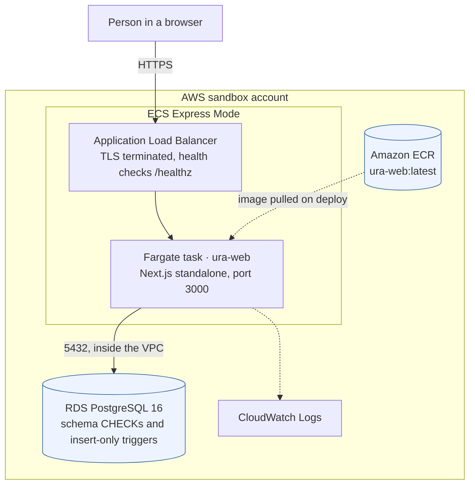
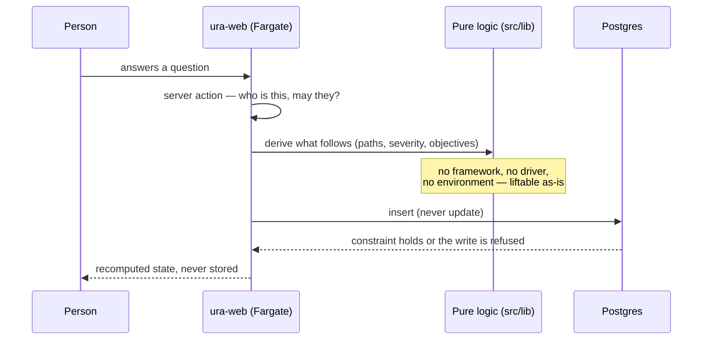
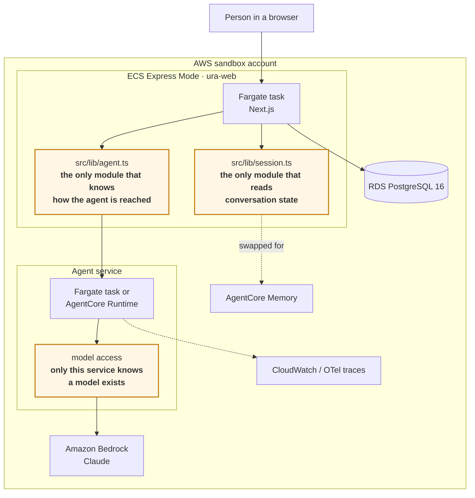

# Architecture

Two pictures: what deploys today, and what changes when the agentic layer
arrives. The second one is the reason the first one is shaped as it is.

---

## Today — Phase 1, deterministic

One container and a database. Nothing else is load-bearing.

**Where the rules live.** Not in the container. Four-eyes on a risk
acceptance, insert-only evidence, "a submission has a timestamp *and* a
submitter or neither" — these are CHECK constraints and triggers in Postgres
(SPEC §5, §7). Replacing the web tier changes nothing about them, which is
the point.

---

## The request path

The middle layer is deliberately portable: `src/lib/*` imports no framework,
no database driver and no environment (SPEC §26.1, enforced by
`test/unit/architecture.test.ts`). The same functions run unchanged behind a
Lambda handler or an AgentCore task.

---

## Phase 2 — the agentic layer on Bedrock and AgentCore

Nothing above is discarded. A second service appears, and the web app reaches
it through exactly one module.

### The three seams (SPEC §6.1)

Everything portable about this design is these three modules. Each exists so
that moving to AWS changes configuration, not code.

| Seam | Module | What it hides | What it becomes |
|---|---|---|---|
| Agent access | `src/lib/agent.ts` | How the agent is reached | Local HTTP now, **AgentCore Runtime** later |
| Session state | `src/lib/session.ts` | Where conversation state lives | Postgres now, **AgentCore Memory** later |
| Model access | `agent/src/model.ts` | That a model exists at all | **Bedrock** via `AGENT_PROVIDER`; the web app never imports a model SDK |

**The rule that keeps it true:** nothing else in the codebase may address the
agent, read conversation state, or import a model SDK. That is not a
convention — it is asserted by tests, in the same file that already forbids
the pure layer from importing a driver.

### What the agent may never do (SPEC §7)

Worth stating on the same page as the architecture, because it is an
architectural constraint and not a prompt:

- Answer from nothing, or paraphrase evidence — every drafted answer carries
  a **verbatim** quote from what the requester provided.
- Attest, declare, resolve or accept anything. Those are people's acts, and
  the authority checks that enforce them are server-side and derived from the
  question, never from the caller's request.
- Act as an autonomous orchestrator. **AgentCore is substrate, never the
  decider.**

A drafted answer arrives as a proposal a person confirms. That is why the
reviewer's rubric already has a criterion for it, sitting deliberately empty:
*"Grounded in a quoted source — nothing drafts answers yet, so there is no
evidence trail to weigh."*

---

## Cost, roughly

For a demo left running in a sandbox:

| Resource | Shape | Rough monthly |
|---|---|---|
| ECS Express (Fargate) | 1 vCPU / 2 GB, 1 task | ~$35 |
| Application Load Balancer | provisioned by Express Mode | ~$18 |
| RDS `db.t4g.micro` | 20 GB gp3, single-AZ | ~$15 |
| ECR + CloudWatch | a few images, modest logs | ~$2 |

Call it **$70/month** left running, and close to nothing if you tear it down
between demos. Express Mode itself costs nothing extra — you pay for what it
creates.
